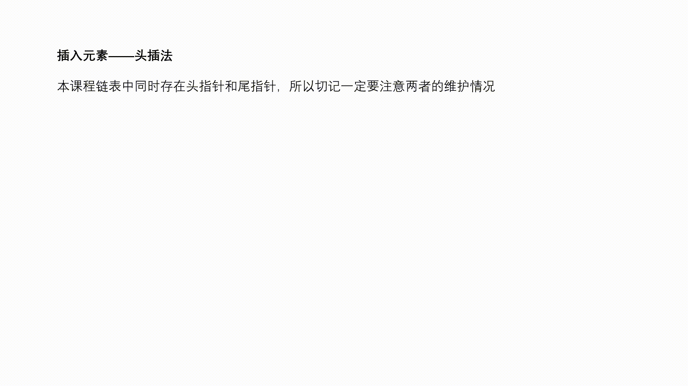

# java集合源码分析


大家平时在用java写代码的时候，使用的数据结构最多的就是java自己封装好的集合类。但是当我们使用这些封装好的集合类的时候，不了解底层原理，或多或少就会碰到由于不知道底层原理，导致开发时忽略的细节，造成开发甚至是生产方面的BUG。防微杜渐，产品的质量是计划出来的，未雨绸缪的。所以，下面就java常用集合专题，揭开java集合的神秘面纱。包括ArrayList；LinkedList；HashSet；HashMap；线程安全的ConcurrentHashMap。我会将个人理解与源代码结合，将个人解读写在源代码注释中，边看源码边学习。

# 1 ArrayList

## 1.1 整体架构

ArrayList 整体架构比较简单，就是一个数组结构，比较简单，如下图：


图中展示是长度为 10 的数组，从 1 开始计数，index 表示数组的下标，从 0 开始计数，elementData 表示数组本身，源码中除了这两个概念，还有以下三个基本概念：

- DEFAULT_CAPACITY 表示数组的初始大小，默认是 10，这个数字要记住；
- size 表示当前数组的大小，类型 int，没有使用 volatile 修饰，非线程安全的；
- modCount 统计当前数组被修改的版本次数，数组结构有变动，就会 +1。

下面是源码：

```java
public class ArrayList<E> extends AbstractList<E>
        implements List<E>, RandomAccess, Cloneable, java.io.Serializable
{

	//初始容量大小10
    private static final int DEFAULT_CAPACITY = 10;
	//大小为0实例
    private static final Object[] EMPTY_ELEMENTDATA = {};
	//默认初始化的空实例，元素增加时自动grow
    private static final Object[] DEFAULTCAPACITY_EMPTY_ELEMENTDATA = {};
    /**
    存储arraylist元素的数组缓冲区。
    arraylist的容量是这个数组缓冲区的长度。任何带有		elementdata==defaultcapacity_empty_elementdata的空arraylist将在添加第一个元素时扩展为默认容量*/
    transient Object[] elementData; // non-private to simplify nested class access
    //当前大小
    private int size;
    //最大容量
    private static final int MAX_ARRAY_SIZE = Integer.MAX_VALUE - 8;
 }
```

## 1.2 类注释

了解一个类，就需要先看类注释，一个完整的类注释，可以让使用者快速了解一个类，往往事半功倍，下面我们来看一下ArrayList的类注释写了什么（因为源码的类注释很长，下面就简短的挑一些重点的说明并总结经行阐述）

- 允许 put null 值，会自动扩容；
- size、isEmpty、get、set、add 等方法时间复杂度都是 O (1)；
- 是非线程安全的，多线程情况下，推荐使用线程安全类：Vector(早期的集合，现在不推荐使用了)，Collections.synchronizedList，CopyOnWriteArrayList；
- 增强 for 循环，或者使用迭代器迭代过程中，如果数组大小被改变，会快速失败，抛出异常。


## 1.3 构造函数（初始化）

我们有三种初始化办法：无参数直接初始化、指定大小初始化、指定初始数据初始化，源码如下：

```java
/*
有大小initialCapacity的构造函数
*/
public ArrayList(int initialCapacity) {
    if (initialCapacity > 0) {
        this.elementData = new Object[initialCapacity];
    } else if (initialCapacity == 0) {
        this.elementData = EMPTY_ELEMENTDATA;
    } else {
        throw new IllegalArgumentException("Illegal Capacity: "+
                                           initialCapacity);
    }
}
//无参数直接初始化
public ArrayList() {
	this.elementData = DEFAULTCAPACITY_EMPTY_ELEMENTDATA;
}
//指定初始数据初始化
public ArrayList(Collection<? extends E> c) {
    elementData = c.toArray();
    if ((size = elementData.length) != 0) {
    // c.toArray 可能不会正确返回 Object[]（具体问题请自行看toArray源码）
        if (elementData.getClass() != Object[].class){
        	elementData = Arrays.copyOf(elementData, size, Object[].class);
        } else {
        // 用EMPTY_ELEMENTDATA替代数据.
        this.elementData = EMPTY_ELEMENTDATA;
        }
    }
}

```

补充：使用无参数直接初始化，默认是空的数组，只有当在第一次使用add方法的时候，扩容到DEFAULT_CAPACITY（也就是10）。下面我们可以通过常用的方法，来看看这么一个过程。

## 1.4 方法

### 1.4.1 新增和扩容实现

新增与扩容就是往数组中添加元素，主要分成两步：

- 判断是否需要扩容，如果需要执行扩容操作（默认扩容为原容量大小的1.5倍，直到Integer的最大值）；
- 直接赋值。

```java
public boolean add(E e) {
  //确保数组大小是否足够，不够执行扩容，size 为当前数组的大小
  ensureCapacityInternal(size + 1);  // Increments modCount!!
  //直接赋值，线程不安全的
  elementData[size++] = e;
  return true;
}
private void ensureCapacityInternal(int minCapacity) {
  //如果初始化数组大小时，有给定初始值，以给定的大小为准，不走 if 逻辑
  if (elementData == DEFAULTCAPACITY_EMPTY_ELEMENTDATA) {
    minCapacity = Math.max(DEFAULT_CAPACITY, minCapacity);
  }
  //确保容积足够
  ensureExplicitCapacity(minCapacity);
}
private void ensureExplicitCapacity(int minCapacity) {
  //记录数组被修改
  modCount++;
  // 如果我们期望的最小容量大于目前数组的长度，那么就扩容
  if (minCapacity - elementData.length > 0)
    grow(minCapacity);
}
//扩容，并把现有数据拷贝到新的数组里面去
private void grow(int minCapacity) {
  int oldCapacity = elementData.length;
  // oldCapacity >> 1 是把 oldCapacity 除以 2 的意思
  int newCapacity = oldCapacity + (oldCapacity >> 1);

  // 如果扩容后的值 < 我们的期望值，扩容后的值就等于我们的期望值
  if (newCapacity - minCapacity < 0)
    newCapacity = minCapacity;

  // 如果扩容后的值 > jvm 所能分配的数组的最大值，那么就用 Integer 的最大值
  if (newCapacity - MAX_ARRAY_SIZE > 0)
    newCapacity = hugeCapacity(minCapacity);
 
  // 通过复制进行扩容
  elementData = Arrays.copyOf(elementData, newCapacity);
}
```

### 1.4.2 删除

ArrayList 删除元素有很多种方式，比如根据数组索引删除、根据值删除或批量删除等等，原理和思路都差不多，就选取根据值删除方式来进行源码说明：

```java
public boolean remove(Object o) {
  // 如果要删除的值是 null，找到第一个值是 null 的删除
  if (o == null) {
    for (int index = 0; index < size; index++)
      if (elementData[index] == null) {
        fastRemove(index);
        return true;
      }
  } else {
    // 如果要删除的值不为 null，找到第一个和要删除的值相等的删除
    for (int index = 0; index < size; index++)
      // 这里是根据  equals 来判断值相等的，相等后再根据索引位置进行删除
      if (o.equals(elementData[index])) {
        fastRemove(index);
        return true;
      }
  }
  return false;
}
```

我们需要注意的两点是：

- 新增的时候是没有对 null 进行校验的，所以删除的时候也是允许删除 null 值的；
- 找到值在数组中的索引位置，是通过 equals 来判断的，如果数组元素不是基本类型，需要我们关注 equals 的具体实现。

上面代码已经找到要删除元素的索引位置了，下面代码是根据索引位置进行元素的删除：

```java
private void fastRemove(int index) {
  // 记录数组的结构要发生变动了
  modCount++;
  // numMoved 表示删除 index 位置的元素后，需要从 index 后移动多少个元素到前面去
  // 减 1 的原因，是因为 size 从 1 开始算起，index 从 0开始算起
  int numMoved = size - index - 1;
  if (numMoved > 0)
    // 从 index +1 位置开始被拷贝，拷贝的起始位置是 index，长度是 numMoved
    System.arraycopy(elementData, index+1, elementData, index, numMoved);
  //数组最后一个位置赋值 null，帮助 GC
  elementData[--size] = null;
}
```

从源码中，我们可以看出，某一个元素被删除后，为了维护数组结构，我们都会把数组后面的元素往前移动。

## 1.5 总结

可以发现，ArrayList是一个Object的数组；平时我们用需要用泛型去制约好它，不然会造成元数据操作的问题（比如一个ArrayList里面有Integer，String，到时候对数据的操作就会产生问题）。通过上面源码分析，我们发现，扩容是通过这行代码来实现的：`Arrays.copyOf(elementData, newCapacity);`，这行代码描述的本质是数组之间的拷贝，扩容是会先新建一个符合我们预期容量的新数组，然后把老数组的数据拷贝过去。通过构造函数，我们可以知道，使用没有参数的构造函数构造ArrayList，默认是空数组，当第一次add的时候才会扩容，所以最好在初始话的时候指定好大小，频繁的calculateCapacity扩容会造成一定的性能损耗。

其他的函数也就大同小异，业余时间也可以探索一下其他函数的源码实现。


# 2 LinkedList

## 2.1 整体架构

LinkedList 底层数据结构是一个双向链表，整体结构如下图所示（来源于百度）：


上图代表了一个双向链表结构，链表中的每个节点都可以向前或者向后追溯，我们有几个概念如下：

- 链表每个节点我们叫做 Node，Node 有 prev 属性，代表前一个节点的位置，next 属性，代表后一个节点的位置；
- first 是双向链表的头节点，它的前一个节点是 null。
- last 是双向链表的尾节点，它的后一个节点是 null；
- 当链表中没有数据时，first 和 last 是同一个节点，前后指向都是 null；
- 因为是个双向链表，只要机器内存足够强大，是没有大小限制的。

## 2.2 属性

我们先首先来看一下对于每一个节点，LinkedList保存的是什么

```java
		//node类
    private static class Node<E> {
        //数据
        E item;
        //类似于c的指针，指向下一个节点
        Node<E> next;
        //指向上一个节点
        Node<E> prev;
			// 构造函数
        Node(Node<E> prev, E element, Node<E> next) {
            this.item = element;
            this.next = next;
            this.prev = prev;
        }
    }
```

## 2.3 构造函数（初始化）

LinkedList基本属性中保存了首节点与尾节点与大小，构造函数只有空参构造函数以及指定元素的构造函数两种构造方式，源码如下：

```java
/*
双向链表，操作类似于其他链表
*/
public class LinkedList<E>
    extends AbstractSequentialList<E>
    implements List<E>, Deque<E>, Cloneable, java.io.Serializable
{    //初始size
    transient int size = 0;
    //第一个节点
    transient Node<E> first;
    //上一个节点
    transient Node<E> last;
    //无参构造函数
    public LinkedList() {
     }
    //addAll构造函数
    public LinkedList(Collection<? extends E> c) {
        this();
        addAll(c);
    }
}

```

## 2.4 方法

### 2.4.1 增加

追加节点时，我们可以选择追加到链表头部，还是追加到链表尾部，add 方法默认是从尾部开始追加，addFirst 方法是从头部开始追加，addLast从尾部增加。增加原理同链表的原理类似，请看下面动图吧：



### 2.4.2 删除

节点删除的方式和追加类似，我们可以选择从头部删除，也可以选择从尾部删除，删除操作会把节点的值，前后指向节点都置为 null，帮助 GC 进行回收。下面看图：


补充：上面图片都是以单项列表为例的，其实和双向链表类似，只不过双向链表维护了向前和向后两个指针，也就是执行了单向链表的两次相同的操作。

## 2.5 总结

从数据属性来看，LinkedList是一个双向链表，符合链表的各种特性，比如查找的时间复杂度是O（n），头增加和尾增加都是O（1）等。当然如果链表实现了跳表，查找将会变成log级别的查找。跳表的详细知识，有机会我再出一篇文档吧。

# 3 HashSet

## 3.1 整体架构

HashSet主要是在 Map 的基础上组装起来的类，了解HashSet主要了解HashMap就行，我们学习它主要是学习Set 是如何利用 Map 现有的功能，来达成自己的目标的，也就是说如何基于现有的功能进行创新，然后再看看一些改变的小细节是否值得我们学习。

## 3.2 类注释

看源码先看类注释上，我们可以得到的信息有：

1. 底层实现基于 HashMap，所以迭代时不能保证按照插入顺序，或者其它顺序进行迭代；
2. add、remove、contanins、size 等方法的耗时性能，是不会随着数据量的增加而增加的，这个主要跟 HashMap 底层的数组数据结构有关，不管数据量多大，不考虑 hash 冲突的情况下，时间复杂度都是 O (1)；
3. 线程不安全的，如果需要安全请自行加锁，或者使用 Collections.synchronizedSet；
4. 迭代过程中，如果数据结构被改变，会快速失败的，会抛出 ConcurrentModificationException 异常。

## 3.3 HashSet 是如何组合 HashMap 的

刚才是从类注释 1 中看到，HashSet 的实现是基于 HashMap 的，在 Java 中，要基于基础类进行创新实现，有两种办法：

- 继承基础类，覆写基础类的方法，比如说继承 HashMap , 覆写其 add 的方法；
- 组合基础类，通过调用基础类的方法，来复用基础类的能力。

HashSet 使用的就是组合 HashMap，其优点如下：

1. 继承表示父子类是同一个事物，而 Set 和 Map 本来就是想表达两种事物，所以继承不妥，而且 Java 语法限制，子类只能继承一个父类，后续难以扩展。
2. 组合更加灵活，可以任意的组合现有的基础类，并且可以在基础类方法的基础上进行扩展、编排等，而且方法命名可以任意命名，无需和基础类的方法名称保持一致。

我们在工作中，如果碰到类似问题，我们的原则也是尽量多用组合，少用继承。

组合就是把 HashMap 当作自己的一个局部变量，以下是 HashSet 的组合实现：

```java
// 把 HashMap 组合进来，key 是 Hashset 的 key，value 是下面的 PRESENT
private transient HashMap<E,Object> map;
// HashMap 中的 value
private static final Object PRESENT = new Object();
```

从这两行代码中，我们可以看出两点：

1. 我们在使用 HashSet 时，比如 add 方法，只有一个入参，但组合的 Map 的 add 方法却有 key，value 两个入参，相对应上 Map 的 key 就是我们 add 的入参，value 就是第二行代码中的 PRESENT，此处设计非常巧妙，用一个默认值 PRESENT 来代替 Map 的 Value；
2. 如果 HashSet 是被共享的，当多个线程访问的时候，就会有线程安全问题，因为在后续的所有操作中，并没有加锁。

**总结**

HashSet 在以 HashMap 为基础进行实现的时候，首先选择组合的方式，接着使用默认值来代替了 Map 中的 Value 值，设计得非常巧妙，给使用者的体验很好，使用起来简单方便，我们在工作中也可以借鉴这种思想，可以把底层复杂实现包装一下，一些默认实现可以自己吃掉，使吐出去的接口尽量简单好用。

## 3.4 属性及构造函数

```java

    /**
     * Constructs a new, empty set; the backing <tt>HashMap</tt> instance has
     * default initial capacity (16) and load factor (0.75).
     从源码解释可以看出，Set的数据结构使用的是HashMap，初始大小为16，加载因子为3/4
     */
    public HashSet() {
        map = new HashMap<>();
    }
/**
有原始集合数据进行初始化的情况下，会对 HashMap 的初始容量进行计算
 取括号中两个数的最大值（期望的值 / 0.75+1，默认值 16）
*/
    public HashSet(Collection<? extends E> c) {
        map = new HashMap<>(Math.max((int) (c.size()/.75f) + 1, 16));
        addAll(c);
    }
    public HashSet(int initialCapacity, float loadFactor) {
        map = new HashMap<>(initialCapacity, loadFactor);
    }
    public HashSet(int initialCapacity) {
        map = new HashMap<>(initialCapacity);
    }
    HashSet(int initialCapacity, float loadFactor, boolean dummy) {
        map = new LinkedHashMap<>(initialCapacity, loadFactor);
    }
```

## 3.5 方法

至于 HashSet 的其他方法就比较简单了，就是对 Map 的 api 进行了一些包装，如下所示

```java
//全部都是map的key值的操作
public boolean contains(Object o) {
    return map.containsKey(o);
}

public boolean add(E e) {
    return map.put(e, PRESENT)==null;
}

public boolean remove(Object o) {
    return map.remove(o)==PRESENT;
}
```

## 3.6 总结

从源码看出，HashSet复用HashMap的代码，使用聚合的方式进行复用，所以下文主要以分析HashMap为主。

# 4 HashMap

## 4.1 整体框架

HashMap 底层的数据结构主要是：数组 + 链表 + 红黑树。其中当链表的长度大于等于 8 时，链表会转化成红黑树，当红黑树的大小小于等于 6 时，红黑树会转化成链表，整体的数据结构如下图：


图中左边竖着的是 HashMap 的数组结构，数组的元素可能是单个 Node，也可能是个链表，也可能是个红黑树，比如数组下标索引为 2 的位置就是一个链表，下标索引为 9 的位置对应的就是红黑树。

## 4.2 类注释

从 HashMap 的类注释中，我们可以得到如下信息：

- 允许 null 值，不同于 HashTable ，是线程不安全的；
- load factor（影响因子） 默认值是 0.75， 是均衡了时间和空间损耗算出来的值，较高的值会减少空间开销（扩容减少，数组大小增长速度变慢），但增加了查找成本（hash 冲突增加，链表长度变长），不扩容的条件：数组容量 > 需要的数组大小 /load factor；
- 如果有很多数据需要储存到 HashMap 中，建议 HashMap 的容量一开始就设置成足够的大小，这样可以防止在其过程中不断的扩容，影响性能；
- HashMap 是非线程安全的，我们可以自己在外部加锁，或者通过 Collections.synchronizedMap 来实现线程安全，Collections.synchronizedMap 的实现是在每个方法上加上了 synchronized 锁；或者使用ConcurrentHashMap，下文也会对ConcurrentHashMap进行简单阐述。
- 在迭代过程中，如果 HashMap 的结构被修改，会快速失败。

## 4.3 属性

属性源码如下：

```java

    /**
     * 默认数组初始化大小
     */
    static final int DEFAULT_INITIAL_CAPACITY = 1 << 4; // aka 16

    /**
     * 数组最大大小
     */
    static final int MAXIMUM_CAPACITY = 1 << 30;

    /**
     * 负载系数，用于数组数量达到 CAPACITY*LOAD_FACTOR（默认为12）时，对数组进行扩容
     */
    static final float DEFAULT_LOAD_FACTOR = 0.75f;

    /**
     * 链表树化的长度
     */
    static final int TREEIFY_THRESHOLD = 8;

    /**
     * 红黑树链化的长度
     */
    static final int UNTREEIFY_THRESHOLD = 6;

    /**
     * The smallest table capacity for which bins may be treeified.
     * (Otherwise the table is resized if too many nodes in a bin.)
     * Should be at least 4 * TREEIFY_THRESHOLD to avoid conflicts
     * between resizing and treeification thresholds.
     * 当数组容量大于 64 时，链表才会转化成红黑树
     */
    static final int MIN_TREEIFY_CAPACITY = 64;

    //链表的节点
     static class Node<K,V> implements Map.Entry<K,V> 

     //红黑树的节点
     static final class TreeNode<K,V> extends LinkedHashMap.Entry<K,V> 
```

## 4.1 构造函数

### 4.1.1 指定加载因子以及初始大小

```java
public HashMap(int initialCapacity, float loadFactor) {
    if (initialCapacity < 0)
        throw new IllegalArgumentException("Illegal initial capacity: " +
                                           initialCapacity);
    if (initialCapacity > MAXIMUM_CAPACITY)
        initialCapacity = MAXIMUM_CAPACITY;
    if (loadFactor <= 0 || Float.isNaN(loadFactor))
        throw new IllegalArgumentException("Illegal load factor: " +
                                           loadFactor);
    this.loadFactor = loadFactor;
    this.threshold = tableSizeFor(initialCapacity);
}

```

### 4.1.2 指定初始化大小

```java
public HashMap(int initialCapacity) {
    this(initialCapacity, DEFAULT_LOAD_FACTOR);
}
```

### 4.1.3 空参构造

```java
/**
 * Constructs an empty <tt>HashMap</tt> with the default initial capacity
 * (16) and the default load factor (0.75).
 */
public HashMap() {
    this.loadFactor = DEFAULT_LOAD_FACTOR; // all other fields defaulted
}
```

### 4.1.4 数据集合构造

```java
/**
 * Constructs a new <tt>HashMap</tt> with the same mappings as the
 * specified <tt>Map</tt>.  The <tt>HashMap</tt> is created with
 * default load factor (0.75) and an initial capacity sufficient to
 * hold the mappings in the specified <tt>Map</tt>.
 */
public HashMap(Map<? extends K, ? extends V> m) {
    this.loadFactor = DEFAULT_LOAD_FACTOR;
    putMapEntries(m, false);
}

/**
 * Implements Map.putAll and Map constructor.
 */
final void putMapEntries(Map<? extends K, ? extends V> m, boolean evict) {
    int s = m.size();
    if (s > 0) {
        if (table == null) { // pre-size
            float ft = ((float)s / loadFactor) + 1.0F;
            int t = ((ft < (float)MAXIMUM_CAPACITY) ?
                     (int)ft : MAXIMUM_CAPACITY);
            if (t > threshold)
                threshold = tableSizeFor(t);
        }
        else if (s > threshold)
            resize();
        for (Map.Entry<? extends K, ? extends V> e : m.entrySet()) {
            K key = e.getKey();
            V value = e.getValue();
            putVal(hash(key), key, value, false, evict);
        }
    }
}
```

## 4.2 方法

4.2.1 hash方法

```java
/**
hashCode右移16位，正好是32bit的一半。与自己本身做异或操作（相同为0，不同为1）。就是为了混合哈希值的高位和地位，增加低位的随机性。并且混合后的值也变相保持了高位的特征。
*/
static final int hash(Object key) {
    int h;
    return (key == null) ? 0 : (h = key.hashCode()) ^ (h >>> 16);
}

 public V get(Object key) {
        Node<K,V> e;
        return (e = getNode(hash(key), key)) == null ? null : e.value;
    }
```

### 4.2.1 新增(put与putVal)：

源码如下：

```java
    public V put(K key, V value) {
        return putVal(hash(key), key, value, false, true);
    }
```

新增 key，value 大概的步骤如下：

1. 空数组有无初始化，没有的话初始化；
2. 如果通过 key 的 hash 能够直接找到值，跳转到 6，否则到 3；
3. 如果 hash 冲突，两种解决方案：链表 or 红黑树；
4. 如果是链表，递归循环，把新元素追加到队尾；
5. 如果是红黑树，调用红黑树新增的方法；
6. 通过 2、4、5 将新元素追加成功，再根据 onlyIfAbsent 判断是否需要覆盖；
7. 判断是否需要扩容，需要扩容进行扩容，结束。

我们来画一张示意图来描述下：


源码如下：

```java
// 入参 hash：通过 hash 算法计算出来的值。
// 入参 onlyIfAbsent：false 表示即使 key 已经存在了，仍然会用新值覆盖原来的值，默认为 false
final V putVal(int hash, K key, V value, boolean onlyIfAbsent,
               boolean evict) {
    // n 表示数组的长度，i 为数组索引下标，p 为 i 下标位置的 Node 值
    Node<K,V>[] tab; Node<K,V> p; int n, i;
    //如果数组为空，使用 resize 方法初始化
    if ((tab = table) == null || (n = tab.length) == 0)
        n = (tab = resize()).length;
    // 如果当前索引位置是空的，直接生成新的节点在当前索引位置上
    if ((p = tab[i = (n - 1) & hash]) == null)
        tab[i] = newNode(hash, key, value, null);
    // 如果当前索引位置有值的处理方法，即我们常说的如何解决 hash 冲突
    else {
        // e 当前节点的临时变量
        Node<K,V> e; K k;
        // 如果 key 的 hash 和值都相等，直接把当前下标位置的 Node 值赋值给临时变量
        if (p.hash == hash &&
            ((k = p.key) == key || (key != null && key.equals(k))))
            e = p;
        // 如果是红黑树，使用红黑树的方式新增
        else if (p instanceof TreeNode)
            e = ((TreeNode<K,V>)p).putTreeVal(this, tab, hash, key, value);
        // 是个链表，把新节点放到链表的尾端
        else {
            // 自旋
            for (int binCount = 0; ; ++binCount) {
                // e = p.next 表示从头开始，遍历链表
                // p.next == null 表明 p 是链表的尾节点
                if ((e = p.next) == null) {
                    // 把新节点放到链表的尾部 
                    p.next = newNode(hash, key, value, null);
                    // 当链表的长度大于等于 8 时，链表转红黑树
                    if (binCount >= TREEIFY_THRESHOLD - 1)
                        treeifyBin(tab, hash);
                    break;
                }
                // 链表遍历过程中，发现有元素和新增的元素相等，结束循环
                if (e.hash == hash &&
                    ((k = e.key) == key || (key != null && key.equals(k))))
                    break;
                //更改循环的当前元素，使 p 在遍历过程中，一直往后移动。
                p = e;
            }
        }
        // 说明新节点的新增位置已经找到了
        if (e != null) {
            V oldValue = e.value;
            // 当 onlyIfAbsent 为 false 时，才会覆盖值 
            if (!onlyIfAbsent || oldValue == null)
                e.value = value;
            afterNodeAccess(e);
            // 返回老值
            return oldValue;
        }
    }
    // 记录 HashMap 的数据结构发生了变化
    ++modCount;
    //如果 HashMap 的实际大小大于扩容的门槛，开始扩容
    if (++size > threshold)
        resize();
    afterNodeInsertion(evict);
    return null;
}
```

### 4.2.2 链表的新增

链表的新增比较简单，就是把当前节点追加到链表的尾部，和 LinkedList 的追加实现一样的。

当链表长度大于等于 8 时，此时的链表就会转化成红黑树，转化的方法是：treeifyBin，此方法有一个判断，当链表长度大于等于 8，并且整个数组大小大于 64 时，才会转成红黑树，当数组大小小于 64 时，只会触发扩容，不会转化成红黑树，

**为什么是8**

> 链表查询的时间复杂度是 O (n)，红黑树的查询复杂度是 O (log (n))。在链表数据不多的时候，使用链表进行遍历也比较快，只有当链表数据比较多的时候，才会转化成红黑树，但红黑树需要的占用空间是链表的 2 倍，考虑到转化时间和空间损耗，所以我们需要定义出转化的边界值。
>
> 在考虑设计 8 这个值的时候，我们参考了泊松分布概率函数，由泊松分布中得出结论，链表各个长度的命中概率为：
>
> ```java
> * 0:    0.60653066
> * 1:    0.30326533
> * 2:    0.07581633
> * 3:    0.01263606
> * 4:    0.00157952
> * 5:    0.00015795
> * 6:    0.00001316
> * 7:    0.00000094
> * 8:    0.00000006
> ```
>
> 意思是，当链表的长度是 8 的时候，出现的概率是 0.00000006，不到千万分之一，所以说正常情况下，链表的长度不可能到达 8 ，而一旦到达 8 时，肯定是 hash 算法出了问题，所以在这种情况下，为了让 HashMap 仍然有较高的查询性能，所以让链表转化成红黑树，我们正常写代码，使用 HashMap 时，几乎不会碰到链表转化成红黑树的情况，毕竟概念只有千万分之一。

### 4.2.2 红黑树新增节点过程

1. 首先判断新增的节点在红黑树上是不是已经存在，判断手段有如下两种：

   1.1. 如果节点没有实现 Comparable 接口，使用 equals 进行判断；

   1.2. 如果节点自己实现了 Comparable 接口，使用 compareTo 进行判断。

2. 新增的节点如果已经在红黑树上，直接返回；不在的话，判断新增节点是在当前节点的左边还是右边，左边值小，右边值大；

3. 自旋递归 1 和 2 步，直到当前节点的左边或者右边的节点为空时，停止自旋，当前节点即为我们新增节点的父节点；

4. 把新增节点放到当前节点的左边或右边为空的地方，并于当前节点建立父子节点关系；

5. 进行着色和旋转，结束

### 4.2.3 resize（）:扩容并重新计算大小

当HashMap容量大小不够时，就需要扩容，调用的就是resize()方法，下面对resize进行分析。

先看源码：

```java
final Node<K,V>[] resize() {
    Node<K,V>[] oldTab = table;
    int oldCap = (oldTab == null) ? 0 : oldTab.length;
    int oldThr = threshold;
    int newCap, newThr = 0;
    if (oldCap > 0) {
        // 超过最大值就不再扩充了，就只好随你碰撞去吧
        if (oldCap >= MAXIMUM_CAPACITY) {
            threshold = Integer.MAX_VALUE;
            return oldTab;
        }
        // 没超过最大值，就扩充为原来的2倍
        else if ((newCap = oldCap << 1) < MAXIMUM_CAPACITY &&
                 oldCap >= DEFAULT_INITIAL_CAPACITY)
            newThr = oldThr << 1; // double threshold
    }
    else if (oldThr > 0) // initial capacity was placed in threshold
        newCap = oldThr;
    else {               // zero initial threshold signifies using defaults
        newCap = DEFAULT_INITIAL_CAPACITY;
        newThr = (int)(DEFAULT_LOAD_FACTOR * DEFAULT_INITIAL_CAPACITY);
    }
    // 计算新的resize上限
    if (newThr == 0) {

        float ft = (float)newCap * loadFactor;
        newThr = (newCap < MAXIMUM_CAPACITY && ft < (float)MAXIMUM_CAPACITY ?
                  (int)ft : Integer.MAX_VALUE);
    }
    threshold = newThr;
    @SuppressWarnings({"rawtypes"，"unchecked"})
        Node<K,V>[] newTab = (Node<K,V>[])new Node[newCap];
    table = newTab;
    if (oldTab != null) {
        // 把每个bucket都移动到新的buckets中
        for (int j = 0; j < oldCap; ++j) {
            Node<K,V> e;
            if ((e = oldTab[j]) != null) {
                oldTab[j] = null;
                if (e.next == null)
                    newTab[e.hash & (newCap - 1)] = e;
                else if (e instanceof TreeNode)
                    ((TreeNode<K,V>)e).split(this, newTab, j, oldCap);
                else { // 链表优化重hash的代码块
                    Node<K,V> loHead = null, loTail = null; // 原索引存放的引用
                    Node<K,V> hiHead = null, hiTail = null; // 原索引+oldCap存放的引用
                    Node<K,V> next;
                    do {
                        next = e.next;
                       /*
                       取余(%)操作中如果除数是2的幂次则等价于与其除数减一的与(&)操作
                     （也就是说 hash%length==hash&(length-1)的前提是 length 是2的 n 次方；）。
                      */
                        // 原索引
                        if ((e.hash & oldCap) == 0) {
                            if (loTail == null)
                                loHead = e;
                            else
                                loTail.next = e; // 头插法
                            loTail = e; // 头插法
                        } else { // 原索引+oldCap
                            if (hiTail == null)
                                hiHead = e;
                            else
                                hiTail.next = e;
                            hiTail = e;
                        }
                    } while ((e = next) != null);
                    // 原索引放到bucket里
                    if (loTail != null) {
                        loTail.next = null;
                        newTab[j] = loHead;
                    }
                    // 原索引+oldCap放到bucket里
                    if (hiTail != null) {
                        hiTail.next = null;
                        newTab[j + oldCap] = hiHead;
                    }
                }
            }
        }
    }
    return newTab;
}
```

> 解释
>
> 元素在重新计算hash之后，因为n变为2倍，那么n-1的mask范围在高位多1bit(红色)，因此新的index就会发生这样的变化：
>
> 
>
> 
>
> 因此，我们在扩充HashMap的时候，不需要像JDK1.7的实现那样重新计算hash，只需要看看原来的hash值新增的那个bit是1还是0就好了，是0的话索引没变，是1的话索引变成“原索引+oldCap”，可以看看下图为16扩充为32的resize示意图：
>
> 
>
> 
>
> 
>
> 对index计算的解释
>
> 1.如果旧表数组index只有一个元素，则直接计算新值`newTab[e.hash & (newCap - 1)] = e;`
>
> 2.如果旧表数组index是链表，则执行一下操作：
>
> ```java
>                         if ((e.hash & oldCap) == 0) {
>                             if (loTail == null)
>                                 loHead = e;
>                             else
>                                 loTail.next = e; // 头插法
>                             loTail = e; // 头插法
>                         } else { // 原索引+oldCap
>                             if (hiTail == null)
>                                 hiHead = e;
>                             else
>                                 hiTail.next = e;
>                             hiTail = e;
>                         }
> 
> ```
>
> 为什么是e.hash & oldCap？
>
> (e.hash & oldCap) 得到的是 元素的在数组中的位置是否需要移动,示例如下
> 示例1：
> e.hash=10 0000 1010
> oldCap=16 0001 0000
> 	 &   =0	 0000 0000       比较高位的第一位 0
> 结论：元素位置在扩容后数组中的位置没有发生改变
> 							
> 示例2：
> e.hash=17 0001 0001
> oldCap=16 0001 0000
> 	 &   =1	 0001 0000      比较高位的第一位   1
> 结论：元素位置在扩容后数组中的位置发生了改变，新的下标位置是原下标位置+原数组长度
>
> 

# 5 ConcurrentHashMap

当我们碰到线程不安全场景下，需要使用 Map 的时候，我们第一个想到的 API 估计就是 ConcurrentHashMap，ConcurrentHashMap 内部封装了锁和各种数据结构来保证访问 Map 是线程安全的，接下来我们一一来看下，和 HashMap 相比，多了哪些数据结构，又是如何保证线程安全的。

## 5.1 结构

虽然 ConcurrentHashMap 的底层数据结构，和方法的实现细节和 HashMap 大体一致，但两者在类结构上却没有任何关联，我们看下 ConcurrentHashMap 的类图：

看 ConcurrentHashMap 源码，我们会发现很多方法和代码和 HashMap 很相似，有的同学可能会问，为什么不继承 HashMap 呢？继承的确是个好办法，但尴尬的是，ConcurrentHashMap 都是在方法中间进行一些加锁操作，也就是说加锁把方法切割了，继承就很难解决这个问题。

### 5.1.1 两者的相同之处：

1. 数组、链表结构几乎相同，所以底层对数据结构的操作思路是相同的（只是思路相同，底层实现不同）；
2. 都实现了 Map 接口，继承了 AbstractMap 抽象类，所以大多数的方法也都是相同的，HashMap 有的方法，ConcurrentHashMap 几乎都有，所以当我们需要从 HashMap 切换到 ConcurrentHashMap 时，无需关心两者之间的兼容问题。

### 5.1.2 不同之处：

1. 红黑树结构略有不同，HashMap 的红黑树中的节点叫做 TreeNode，TreeNode 不仅仅有属性，还维护着红黑树的结构，比如说查找，新增等等；ConcurrentHashMap 中红黑树被拆分成两块，TreeNode 仅仅维护的属性和查找功能，新增了 TreeBin，来维护红黑树结构，并负责根节点的加锁和解锁；
2. 新增 ForwardingNode （转移）节点，扩容的时候会使用到，通过使用该节点，来保证扩容时的线程安全。

如下图所示：


## 5.2 类注释

我们从类注释上大概可以得到如下信息：

1. 所有的操作都是线程安全的，我们在使用时，无需再加锁；
2. 多个线程同时进行 put、remove 等操作时并不会阻塞，可以同时进行，和 HashTable 不同，HashTable 在操作时，会锁住整个 Map；
3. 迭代过程中，即使 Map 结构被修改，也不会抛 ConcurrentModificationException 异常；
4. 除了数组 + 链表 + 红黑树的基本结构外，新增了转移节点，是为了保证扩容时的线程安全的节点；
5. 提供了很多 Stream 流式方法，比如说：forEach、search、reduce 等等。

从类注释中，我们可以看出 ConcurrentHashMap 和 HashMap 相比，新增了转移节点的数据结构，至于底层如何实现线程安全，转移节点的具体细节，暂且看不出来，接下来我们细看源码

## 5.3 属性

```java
public class ConcurrentHashMap<K,V> extends AbstractMap<K,V>
    implements ConcurrentMap<K,V>, Serializable {
    private static final long serialVersionUID = 7249069246763182397L;
    // 表的最大容量
    private static final int MAXIMUM_CAPACITY = 1 << 30;
    // 默认表的大小
    private static final int DEFAULT_CAPACITY = 16;
    // 最大数组大小
    static final int MAX_ARRAY_SIZE = Integer.MAX_VALUE - 8;
    // 默认并发数
    private static final int DEFAULT_CONCURRENCY_LEVEL = 16;
    // 装载因子
    private static final float LOAD_FACTOR = 0.75f;
    // 转化为红黑树的阈值
    static final int TREEIFY_THRESHOLD = 8;
    // 由红黑树转化为链表的阈值
    static final int UNTREEIFY_THRESHOLD = 6;
    // 转化为红黑树的表的最小容量
    static final int MIN_TREEIFY_CAPACITY = 64;
    // 每次进行转移的最小值
    private static final int MIN_TRANSFER_STRIDE = 16;
    // 生成sizeCtl所使用的bit位数
    private static int RESIZE_STAMP_BITS = 16;
    // 进行扩容所允许的最大线程数
    private static final int MAX_RESIZERS = (1 << (32 - RESIZE_STAMP_BITS)) - 1;
    // 记录sizeCtl中的大小所需要进行的偏移位数
    private static final int RESIZE_STAMP_SHIFT = 32 - RESIZE_STAMP_BITS;    
    // 一系列的标识
    static final int MOVED     = -1; // hash for forwarding nodes
    static final int TREEBIN   = -2; // hash for roots of trees
    static final int RESERVED  = -3; // hash for transient reservations
    static final int HASH_BITS = 0x7fffffff; // usable bits of normal node hash
    // 
    /** Number of CPUS, to place bounds on some sizings */
    // 获取可用的CPU个数
    static final int NCPU = Runtime.getRuntime().availableProcessors();
    // 
    /** For serialization compatibility. */
    // 进行序列化的属性
    private static final ObjectStreamField[] serialPersistentFields = {
        new ObjectStreamField("segments", Segment[].class),
        new ObjectStreamField("segmentMask", Integer.TYPE),
        new ObjectStreamField("segmentShift", Integer.TYPE)
    };
    
    // 表
    transient volatile Node<K,V>[] table;
    // 下一个表
    private transient volatile Node<K,V>[] nextTable;
    //
    /**
     * Base counter value, used mainly when there is no contention,
     * but also as a fallback during table initialization
     * races. Updated via CAS.
     */
    // 基本计数
    private transient volatile long baseCount;
    //
    /**
     * Table initialization and resizing control.  When negative, the
     * table is being initialized or resized: -1 for initialization,
     * else -(1 + the number of active resizing threads).  Otherwise,
     * when table is null, holds the initial table size to use upon
     * creation, or 0 for default. After initialization, holds the
     * next element count value upon which to resize the table.
     */
    // 对表初始化和扩容控制
    private transient volatile int sizeCtl;
    
    /**
     * The next table index (plus one) to split while resizing.
     */
    // 扩容下另一个表的索引
    private transient volatile int transferIndex;

    /**
     * Spinlock (locked via CAS) used when resizing and/or creating CounterCells.
     */
    // 旋转锁
    private transient volatile int cellsBusy;

    /**
     * Table of counter cells. When non-null, size is a power of 2.
     */
    // counterCell表
    private transient volatile CounterCell[] counterCells;

    // views
    // 视图
    private transient KeySetView<K,V> keySet;
    private transient ValuesView<K,V> values;
    private transient EntrySetView<K,V> entrySet;
    
    // Unsafe mechanics
    private static final sun.misc.Unsafe U;
    private static final long SIZECTL;
    private static final long TRANSFERINDEX;
    private static final long BASECOUNT;
    private static final long CELLSBUSY;
    private static final long CELLVALUE;
    private static final long ABASE;
    private static final int ASHIFT;

    static {
        try {
            U = sun.misc.Unsafe.getUnsafe();
            Class<?> k = ConcurrentHashMap.class;
            SIZECTL = U.objectFieldOffset
                (k.getDeclaredField("sizeCtl"));
            TRANSFERINDEX = U.objectFieldOffset
                (k.getDeclaredField("transferIndex"));
            BASECOUNT = U.objectFieldOffset
                (k.getDeclaredField("baseCount"));
            CELLSBUSY = U.objectFieldOffset
                (k.getDeclaredField("cellsBusy"));
            Class<?> ck = CounterCell.class;
            CELLVALUE = U.objectFieldOffset
                (ck.getDeclaredField("value"));
            Class<?> ak = Node[].class;
            ABASE = U.arrayBaseOffset(ak);
            int scale = U.arrayIndexScale(ak);
            if ((scale & (scale - 1)) != 0)
                throw new Error("data type scale not a power of two");
            ASHIFT = 31 - Integer.numberOfLeadingZeros(scale);
        } catch (Exception e) {
            throw new Error(e);
        }
    }
}
```


## 5.4 方法

### 5.4.1 新增元素（putVal）

put函数底层调用了putVal进行数据的插入，对于putVal函数的流程大体如下。

　　① 判断存储的key、value是否为空，若为空，则抛出异常，否则，进入步骤②

　　② 计算key的hash值，随后进入无限循环，该无限循环可以确保成功插入数据，若table表为空或者长度为0，则初始化table表，否则，进入步骤③

　　③ 根据key的hash值取出table表中的结点元素，若取出的结点为空（该桶为空），则使用CAS将key、value、hash值生成的结点放入桶中。否则，进入步骤④

　　④ 若该结点的的hash值为**MOVED，则对该桶中的结点进行转移（协助转换）**，否则，进入步骤⑤

　　⑤ 对桶中的第一个结点（即table表中的结点）进行加锁，对该桶进行遍历，桶中的结点的hash值与key值与给定的hash值和key值相等，则根据标识选择是否进行更新操作（用给定的value值替换该结点的value值），若遍历完桶仍没有找到hash值与key值和指定的hash值与key值相等的结点，则直接新生一个结点并赋值为之前最后一个结点的下一个结点。进入步骤⑥

　　⑥ 若**binCount**值达到红黑树转化的阈值，则将桶中的结构转化为红黑树存储，最后，增加binCount的值。

```java
final V putVal(K key, V value, boolean onlyIfAbsent) {
        if (key == null || value == null) throw new NullPointerException(); // 键或值为空，抛出异常
        // 键的hash值经过计算获得hash值
        int hash = spread(key.hashCode());
        int binCount = 0;
        for (Node<K,V>[] tab = table;;) { // 无限循环
            Node<K,V> f; int n, i, fh;
            if (tab == null || (n = tab.length) == 0) // 表为空或者表的长度为0
                // 初始化表
                tab = initTable();//里面使用sizeCtl控制多线程争用问题，cas修改sizeCtl
            else if ((f = tabAt(tab, i = (n - 1) & hash)) == null) { // 表不为空并且表的长度大于0，并且该桶不为空
                if (casTabAt(tab, i, null,
                             new Node<K,V>(hash, key, value, null))) // 比较并且交换值，如tab的第i项为空则用新生成的node替换
                    break;                   // no lock when adding to empty bin
            }
            else if ((fh = f.hash) == MOVED) // 该结点的hash值为MOVED
                // 进行结点的转移（在扩容的过程中）
                tab = helpTransfer(tab, f);
            else {
                V oldVal = null;
                synchronized (f) { // 加锁同步
                    if (tabAt(tab, i) == f) { // 找到table表下标为i的节点
                        if (fh >= 0) { // 该table表中该结点的hash值大于0
                            // binCount赋值为1
                            binCount = 1;
                            for (Node<K,V> e = f;; ++binCount) { // 无限循环
                                K ek;
                                if (e.hash == hash &&
                                    ((ek = e.key) == key ||
                                     (ek != null && key.equals(ek)))) { // 结点的hash值相等并且key也相等
                                    // 保存该结点的val值
                                    oldVal = e.val;
                                    if (!onlyIfAbsent) // 进行判断
                                        // 将指定的value保存至结点，即进行了结点值的更新
                                        e.val = value;
                                    break;
                                }
                                // 保存当前结点
                                Node<K,V> pred = e;
                                if ((e = e.next) == null) { // 当前结点的下一个结点为空，即为最后一个结点
                                    // 新生一个结点并且赋值给next域
                                    pred.next = new Node<K,V>(hash, key,
                                                              value, null);
                                    // 退出循环
                                    break;
                                }
                            }
                        }
                        else if (f instanceof TreeBin) { // 结点为红黑树结点类型
                            Node<K,V> p;
                            // binCount赋值为2
                            binCount = 2;
                            if ((p = ((TreeBin<K,V>)f).putTreeVal(hash, key,
                                                           value)) != null) { // 将hash、key、value放入红黑树
                                // 保存结点的val
                                oldVal = p.val;
                                if (!onlyIfAbsent) // 判断
                                    // 赋值结点value值
                                    p.val = value;
                            }
                        }
                    }
                }
                if (binCount != 0) { // binCount不为0
                    if (binCount >= TREEIFY_THRESHOLD) // 如果binCount大于等于转化为红黑树的阈值
                        // 进行转化
                        treeifyBin(tab, i);
                    if (oldVal != null) // 旧值不为空
                        // 返回旧值
                        return oldVal;
                    break;
                }
            }
        }
        // 增加binCount的数量
        addCount(1L, binCount);
        return null;
    }
```

> 我想有基础的同学知道在jdk1.7中是采用Segment + HashEntry + ReentrantLock的方式进行实现的，而1.8中放弃了Segment臃肿的设计，取而代之的是采用Node + CAS + Synchronized来保证并发安全进行实现。
>
> - JDK1.8的实现降低锁的粒度，JDK1.7版本锁的粒度是基于Segment的，包含多个HashEntry，而**JDK1.8锁的粒度就是HashEntry（首节点）**
>
> - JDK1.8版本的数据结构变得更加简单，使得操作也更加清晰流畅，因为已经使用synchronized来进行同步，所以不需要分段锁的概念，也就不需要Segment这种数据结构了，由于粒度的降低，实现的复杂度也增加了
>
> - JDK1.8使用红黑树来优化链表，基于长度很长的链表的遍历是一个很漫长的过程，而红黑树的遍历效率是很快的，代替一定阈值的链表，这样形成一个最佳拍档

### 5.4.2 扩容及协助扩容

当put的时候，有下面这样一句代码：

```java
// 该结点的hash值为MOVED
else if ((fh = f.hash) == MOVED) 
// 进行结点的转移（在扩容的过程中）
tab = helpTransfer(tab, f);
```

所以，每个线程都会去帮助正在扩容的map去扩容——协助扩容。

通过Unsafe.compareAndSwapInt修改sizeCtl值，保证只有一个线程能够初始化nextTable，扩容后的数组长度为原来的两倍，但是容量是原来的1.5。

节点从table移动到nextTable，大体思想是遍历、复制的过程。

1. 首先根据运算得到需要遍历的次数i，然后利用tabAt方法获得i位置的元素f，初始化一个forwardNode实例fwd。
2. 如果f == null，则在table中的i位置放入fwd，这个过程是采用Unsafe.compareAndSwapObjectf方法实现的，很巧妙的实现了节点的并发移动。

3. 如果f是链表的头节点，就构造一个反序链表，把他们分别放在nextTable的i和i+n的位置上，移动完成，采用Unsafe.putObjectVolatile方法给table原位置赋值fwd。

4. 如果f是TreeBin节点，也做一个反序处理，并判断是否需要untreeify，把处理的结果分别放在nextTable的i和i+n的位置上，移动完成，同样采用Unsafe.putObjectVolatile方法给table原位置赋值fwd。

遍历过所有的节点以后就完成了复制工作，把table指向nextTable，并更新sizeCtl为新数组大小的0.75倍 ，扩容完成。

源码如下：

```java
    /**
     * A node inserted at head of bins during transfer operations.
     */
    static final class ForwardingNode<K,V> extends Node<K,V> {
        final Node<K,V>[] nextTable;
        ForwardingNode(Node<K,V>[] tab) {
            super(MOVED, null, null, null);
            this.nextTable = tab;
        }

        Node<K,V> find(int h, Object k) {
            // loop to avoid arbitrarily deep recursion on forwarding nodes
            outer: for (Node<K,V>[] tab = nextTable;;) {
                Node<K,V> e; int n;
                if (k == null || tab == null || (n = tab.length) == 0 ||
                    (e = tabAt(tab, (n - 1) & h)) == null)
                    return null;
                for (;;) {
                    int eh; K ek;
                    if ((eh = e.hash) == h &&
                        ((ek = e.key) == k || (ek != null && k.equals(ek))))
                        return e;
                    if (eh < 0) {
                        if (e instanceof ForwardingNode) {
                            tab = ((ForwardingNode<K,V>)e).nextTable;
                            continue outer;
                        }
                        else
                            return e.find(h, k);
                    }
                    if ((e = e.next) == null)
                        return null;
                }
            }
        }
    }
```


## 注意

大家平时都特别喜欢用map这个集合，但是有一个问题得注意一下：jdk1.7HashMap与jdk1.8concurrenthashmap出现的死循环问题（map.computeIfAbsent这个函数，有兴趣的可以去看下源码，有机会为大家解说一波）。

## 总结

- 在1.8中ConcurrentHashMap的get操作全程不需要加锁，这也是它比其他并发集合比如hashtable、用Collections.synchronizedMap()包装的hashmap;安全效率高的原因之一。
- get操作全程不需要加锁是因为Node的成员val是用volatile修饰的和数组用volatile修饰没有关系。
- 数组用volatile修饰主要是保证在数组扩容的时候保证可见性。


以上就是我对集合类的一些看法，大家有什么问题，及时提出更正！


